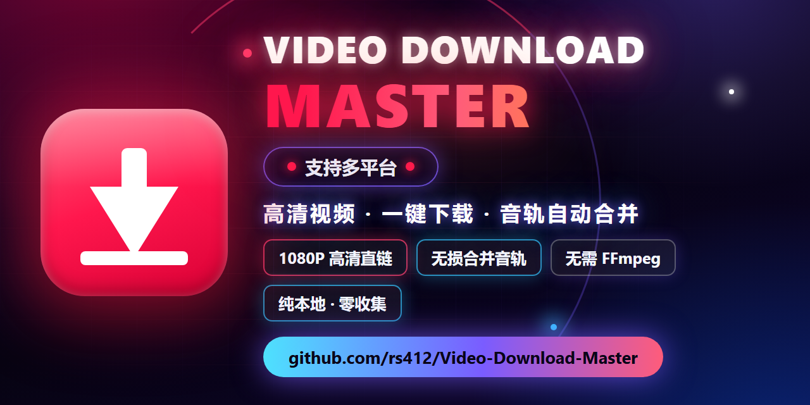

# Video Download Master

一款 Edge / Chrome 浏览器扩展（Manifest V3），用于嗅探并下载网页视频。

> **仅用于你拥有版权或已获授权的内容。**

---

## 功能特性

- **多站点支持**：部分主流视频站的一键嗅探与下载。
- **格式合并**：自动合并分离的视频流与音频流为单个 MP4 文件。
- **自适应格式**：支持 DASH / HLS（含 AES-128 加密 HLS 解密）等自适应流。
- **字幕 / 封面 / 元数据**：可导出 SRT / VTT / LRC / TXT 字幕、封面图与 `metadata.json`。
- **文件名模板**：通过 `{title}` `{author}` `{id}` `{quality}` `{itag}` `{ext}` `{date}` 自定义保存文件名。
- **隐私优先**：仅申请必要的 `storage` / `downloads` 权限，不发起任何遥测、不收集用户数据、不含埋点。

---

## 支持的站点

本扩展支持**部分网站**的视频嗅探与下载（合并与自适应格式）。

不同站点的可用性取决于其页面结构与鉴权策略：

- 多数主流视频站可正常嗅探并下载；
- 个别站点因分片带动态签名、与播放会话绑定的鉴权或强反爬策略，**暂时无法稳定下载**，扩展会在页面直接给出「当前站点暂未提供下载支持」的提示，不做无效下载尝试。

具体支持范围会随站点改版与扩展更新而变化，请以实际体验为准。

---

## 安装

### 开发者模式（加载解压缩的扩展）

1. 打开 `edge://extensions/`（Edge）或 `chrome://extensions/`（Chrome）。
2. 右上角打开 **「开发人员模式」**。
3. 点击 **「加载解压缩的扩展」**，选择本仓库根目录（含 `manifest.json` 的文件夹）。
4. 打开目标视频页，点击工具栏扩展图标即可使用。

---

## 隐私说明

- 本扩展**不收集、不上传、不共享**任何用户个人信息或浏览记录。
- 所有嗅探与下载动作均在本地完成：仅向视频所在站点及其 CDN 发起必要的媒体请求。
- 扩展通过 `webRequest` 读取请求的 **URL / Content-Type / Content-Length** 头部用于识别媒体资源，**不读取也不留存响应体内容**。
- 没有第三方分析、广告 SDK 或远程 beacon。

---

## 免责声明

详见 [DISCLAIMER.md](./DISCLAIMER.md)。

---

## 许可证

- 本扩展**自身源代码**以 **MIT 许可证**开源，详见 [LICENSE](./LICENSE)。
- 发布包内 `vendor/` 目录**捆绑的第三方开源组件**（astring / meriyah / mediabunny /
  yt.solver.core.js）各自保留其许可证（MIT / ISC / MPL-2.0 / Unlicense），完整署名与许可证
  正文见 [THIRD_PARTY_LICENSES.md](./THIRD_PARTY_LICENSES.md)。

---

## 已知限制

- 受站点反爬 / 鉴权策略影响，部分加密或签名分片可能无法下载（视具体站点而定）。
- 部分站点采用 PO Token 等反爬机制，可能导致个别格式被标记不可用（已在界面置灰提示）。
- 扩展依赖站点页面结构，站点改版可能导致嗅探暂时失效，需等待扩展更新。

---

## 项目结构

```
video-download-master/
├── manifest.json          # MV3 清单（名称、权限、内容脚本注入）
├── popup.html / popup.css / popup.js   # 弹出面板 UI 与逻辑
├── background.js          # Service Worker：offscreen 合并、Referer 伪装、嗅探缓存
├── content.js / media-main.js          # 隔离世界 / 主世界注入
├── main.js                # 主世界视频源解析（含播放器签名求解）
├── lib/                   # 各站点解析器（dash / hls / 第三方平台 / subs / clients / parse / merge）
├── offscreen/             # 后台合并音视频为单个 mp4
├── sandbox.html / sandbox.js           # 播放器签名求解沙箱（部分站点需要）
├── vendor/                # 第三方依赖（yt.solver.core.js / mediabunny / meriyah / astring）
└── icons/                 # 扩展图标（16 / 48 / 128）
```
